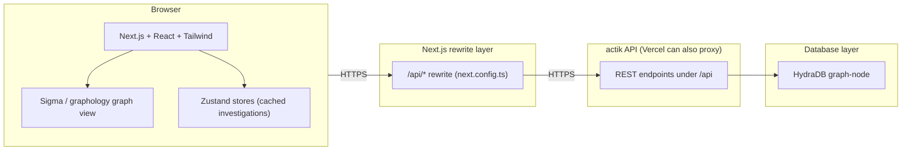
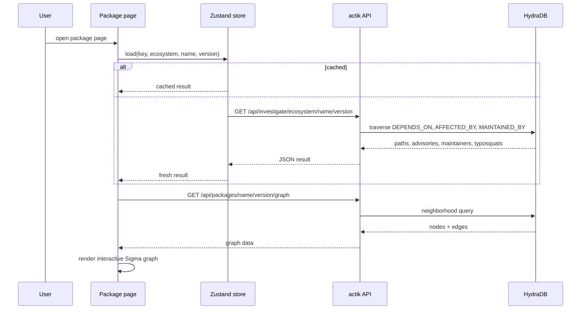

# actik Web

> See the blast radius of a compromised dependency, powered by HydraDB.

actik Web is the frontend for the actik supply-chain intelligence platform. It is a Next.js application that turns the graph stored in the actik API into an investigation workspace. Search a package, scan a repository, run blast-radius analysis, replay exposure windows, and watch for new advisories, all backed by real HydraDB graph traversals served by the actik API.

Built for the [Hack Hydra](https://hackhydra.hydradb.com) Track 02A brief (Repos, Dependencies + Code as Graphs).

## Highlights

- Next.js 16 App Router with React 19 and TypeScript
- Interactive dependency graph rendered with Sigma (graphology + ForceAtlas2)
- Dark-first developer-security visual design
- Zustand stores for instant, cached investigation results
- Deployable to Vercel in one click

## Screens

### Landing page (/)

Marketing landing page that makes the core argument: software supply chains are graphs. It walks through the platform with a hero, feature grid, a live scanner demo, an FAQ, and an AI assistant teaser.

### Package lookup (/packages)

Browse the ingested ecosystem, filter by npm or PyPI, and jump to any package version.

### Package investigation (/packages/[ecosystem]/[name]/[version])

The heart of the product. One page that pulls the full investigation from `GET /api/investigate/:ecosystem/:name/:version` and renders:

- Advisory cards with severity, summary, **introduced** and **fixed** versions, and a link to the OSV entry
- Time travel, which shows which apps resolved the bad version while the advisory was live
- Blast radius statistics (dependents, max depth, affected repositories and applications)
- An interactive dependency graph (zoom, pan, drag, highlight, full screen)
- Maintainer risk and shared-maintainer relationships
- Possible typosquats with risk scores
- A worm propagation simulation that shows how fast a compromise spreads

### Repository scanner (/scan)

Enter any public GitHub, GitLab, Bitbucket or Codeberg repository. The app fetches its lockfiles, resolves exact versions, and shows an exposure score, every finding, and a minimal fix set with verified upgrade commands.

### Live watch (/watch)

Shows the live OSV watch loop: the last run status, checked versions, and the newest incidents, each with its exposure path from repository to lockfile to package to advisory.

## Architecture



In development the Next.js rewrite (`next.config.ts`) forwards `/api/*` to the local actik API (default `http://localhost:8000`). In production the same rewrite targets the public API URL.

## Tech stack

- Next.js 16 (App Router), React 19, TypeScript
- Tailwind CSS 4 with shadcn/ui components
- Sigma, @react-sigma/core and graphology for the interactive graph
- Recharts for the severity breakdown charts
- Zustand for client state and request caching
- next-themes for light and dark mode
- Vercel Analytics and Speed Insights

## Getting started

Requirements: Node.js 20+ and a running [actik API](../backend) on port 8000 (see the backend README).

```sh
bun install
cp .env.example .env.local
bun run dev
```

Open http://localhost:3000

### Environment variables

| Variable | Purpose | Default |
|---|---|---|
| `BACKEND_URL` | Base URL of the actik API | `http://localhost:8000` |

The app talks to the API exclusively through `/api/*` paths, which Next.js rewrites to `BACKEND_URL`. Set it to the public API URL in production (for example `https://api.actik.xyz`).

## Scripts

```sh
bun run dev          # start the dev server
bun run build        # production build
bun run start        # start the production server
bun run lint         # eslint
bun run typecheck    # tsc --noEmit
bun run format       # prettier
```

## Project structure

```text
actik-frontend/
├── app/
│   ├── layout.tsx              # fonts, theme provider, metadata
│   ├── page.tsx                # landing page
│   ├── packages/               # package lookup + investigation pages
│   ├── scan/                   # repository scanner
│   └── watch/                  # live watch and incidents
├── components/
│   ├── ui/                     # shadcn/ui primitives (button, card, badge)
│   ├── scan/                   # score ring, findings, blast graph, time travel, worm sim
│   ├── header.tsx              # navigation
│   ├── footer.tsx              # footer
│   └── theme-provider.tsx      # dark mode
├── lib/
│   ├── api.ts                  # typed REST client for the actik API
│   ├── types.ts                # shared API types
│   ├── stores/                 # zustand stores (packages, scans, investigations)
│   ├── severity.ts             # severity helpers and colors
│   ├── advisory.ts             # advisory helpers and URLs
│   └── oklch.ts                # theme color helpers for the graph
├── public/                     # static assets and logos
├── next.config.ts              # API rewrite rules
└── .env.example                # configuration
```

## Data flow



## Deployment

The app is designed for Vercel. Connect the repository, set `BACKEND_URL` to the public actik API URL, and deploy. The Next.js rewrite keeps all API calls same-origin from the browser's perspective.

## License

Open source under the [MIT License](LICENSE).

Built with HydraDB for Hack Hydra 2026, Track 02A, Repos, Dependencies + Code as Graphs.